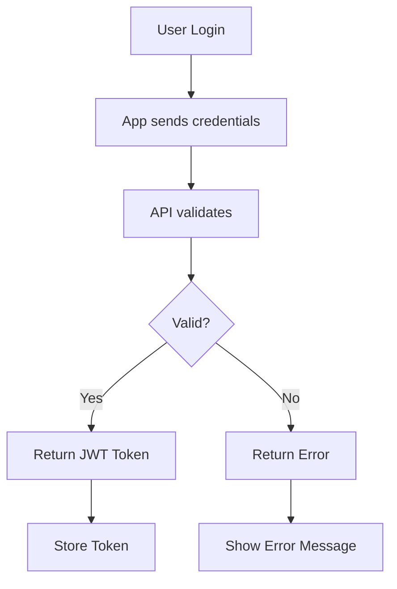
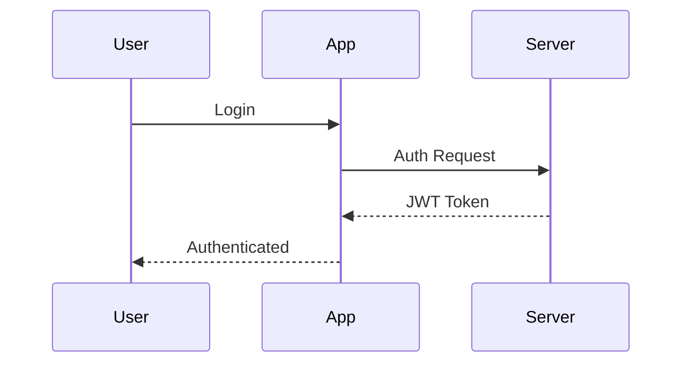
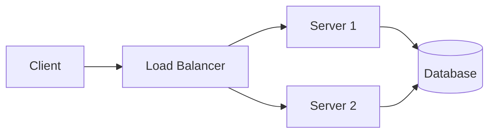

# API Documentation

This section contains the API documentation.

## Endpoints

| Method | Endpoint | Description |
|--------|----------|-------------|
| GET | /users | List all users |
| POST | /users | Create a new user |
| GET | /users/{id} | Get user by ID |
| PUT | /users/{id} | Update user |
| DELETE | /users/{id} | Delete user |

## Authentication Flow

## Sequence Diagram

## Architecture

